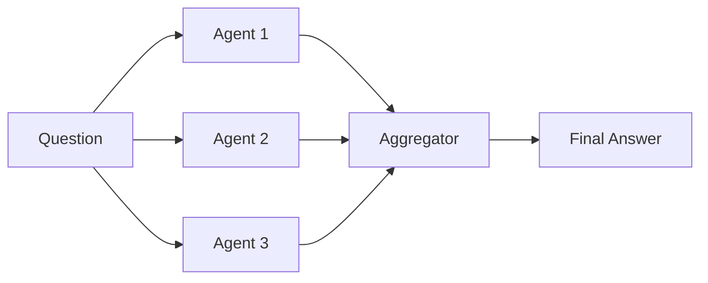
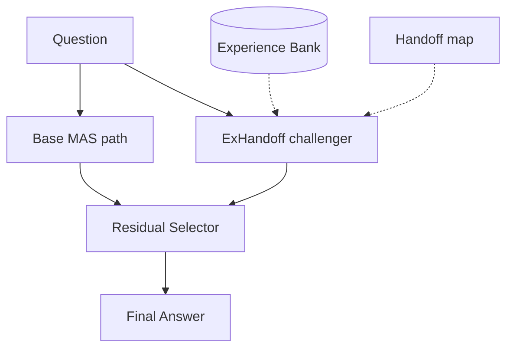

# 方法说明：官方 MASPO 与 EGMAP（ExHandoff）

本仓库在 [官方 MASPO](https://github.com/wangzx1219/MASPO)（commit `e79aa8e`）之上实现 **Experience-Guided Multi-Agent Prompting（EGMAP）**。  
实验对比必须严格区分两条推理协议，不可混用组件。

---

## 1. 官方 MASPO（Baseline）

### 1.1 是什么

MASPO（Multi-Agent System Prompt Optimization）对多智能体图中 **各节点 system prompt** 做联合优化：

- 固定拓扑（如 `llm_agg`：多路推理 + 聚合器）
- **Fixed-rounds** 深度搜索 + **beam-refresh**
- **Misleading sampling** + **lookahead score**（强模型评估候选 prompt）
- 推理阶段：每个 agent 按优化后 prompt **单路执行**，聚合器合并答案

官方实现 **不包含** handoff 接口优化、experience memory、disagreement 双路径、residual 选择器（除非显式开启 Handoff-MASPO 或本仓库的 `--experience-guided` 扩展）。

### 1.2 正式实验中的 MASPO 配置

| 开关 | 值 |
|------|-----|
| `use_handoff` | `False` |
| `use_disagreement_handoff` | `False` |
| `use_residual_selector` | `False` |
| `experience_bank` | `None` |
| `use_structured_meta_prompt`（优化时） | `False` |
| handoff optimize | **不运行** |

优化超参（与论文/官方脚本一致）：

```
depth=3, rounds_per_turn=3, beam_width=2
use_beam_refresh=True, use_misleading_sampling=True, use_lookahead_score=True
lookahead_weights=(0.4, 0.4, 0.2)
```

入口：`run_maspo_formal_one_seed.py` 或：

```bash
python run_maspo.py --optimize --fixed-rounds --beam-refresh \
  --misleading-sampling --lookahead-score \
  # 不加 --experience-guided / --handoff / --residual-selector
```

### 1.3 推理路径（单路）



每个 agent 使用 **MASPO 优化后的节点 prompt**；agent 之间 **无** handoff 消息、**无** 第二条 challenger 路径。

---

## 2. EGMAP / ExHandoff（Ours）

在 MASPO 的 prompt 优化与图执行 runtime 之上，增加 **experience-guided coordination layer**。

### 2.1 相对 MASPO 的增量

| 组件 | 作用 | MASPO 是否有 |
|------|------|:------------:|
| Structured meta-prompt | 优化阶段统一节点/边约束表述 | ❌ |
| Handoff optimization | 优化 sender→receiver 传递契约 | ❌ |
| Adaptive handoff | 推理时传递 evidence / confidence / 结论 | ❌ |
| Disagreement verification | 并行拓扑分歧报告；序列反思 trust-but-verify | ❌ |
| Experience memory bank | 错题检索：错误模式 + 修正建议（无标签泄漏） | ❌ |
| Residual selector | Base 路径 vs ExHandoff challenger；证据充分才切换 | ❌ |

一键开启（`run_maspo.py`）：

```bash
--experience-guided   # 等价于同时打开 handoff + disagreement + residual + bank 检索
```

正式流水线：`run_egmap_formal_one_seed.py`（optimize → opt 上建 bank → frozen eval）。

### 2.2 Experience Memory Bank

- 存储格式：JSONL（`memory/egmap_formal_*_bank.jsonl`）
- **仅写入错题**（含 timeout）；`finalize_experience_bank()` 截断至 `bank_size`
- 构建数据：**仅 opt 划分**（100 题），eval 200 题 **不参与** 写 bank
- 检索：label-free；注入 error pattern + correction advice，**不注入标准答案**
- 推理时 `write_experience=False`，bank 冻结

### 2.3 Adaptive Handoff

- 边级 sender/receiver 契约（`prompt/egmap_formal_*_handoffs.json`）
- Sender 输出：紧凑证据、置信度、当前结论
- Receiver：高置信上游答案默认保留，仅在发现具体矛盾时修订

### 2.4 Disagreement Verification

- 并行拓扑：多路答案不一致时生成 disagreement report
- 序列反思（`nr>1`）：后继 agent 对前驱做 trust-but-verify

### 2.5 Residual Selector

- **Base path**：与 MASPO 类似的单路聚合结果
- **Challenger path**：启用 handoff + experience + disagreement 的 ExHandoff 路径
- 选择规则：仅当 verifier 证据达到 `V11_MIN_CONFIDENCE`（默认 `HIGH`）才采用 challenger
- 选择题（A–D）有确定性解析兜底，不依赖标签

### 2.6 推理路径（双路径 + 选择）



### 2.7 多模态（VQA）

- OpenAI-compatible vision messages
- ChartQA / TextVQA 等：确定性归一化匹配（数值/OCR）

---

## 3. 公平对比协议

| 项目 | 官方 MASPO | EGMAP |
|------|-----------|-------|
| opt/eval 划分 | 相同 seed、`opt_size=100`、`sample_size=200` | 相同（`splits/egmap_formal_*_split.json`） |
| 节点 prompt 来源 | `maspo_formal_*_prompts.json`（MASPO 优化） | `egmap_formal_*_prompts.json`（EGMAP 优化栈） |
| Handoff | 无 | 有（优化 + 推理） |
| 推理栈 | 单路 MAS | handoff + disagreement + residual + bank |
| Work 模型 / token 上限 | 相同（正式：Qwen3.5-9B, tok8192） | 相同 |

**禁止的对照**（此前错误 baseline）：

- 给 MASPO 加载 `egmap_formal_*_handoffs.json`
- 给 MASPO 开启 `residual_selector` / `disagreement_handoff` 但不给 bank
- 用 EGMAP 优化 prompt 却称「官方 MASPO」

---

## 4. 代码映射

| 能力 | 主要模块 | CLI / 脚本 |
|------|----------|------------|
| MASPO 优化 | `optimizers.py`, `agents.py` | `run_maspo_formal_one_seed.py` |
| MASPO 推理 | `agents.MAS.arun` | `run_maspo.py`（无 experience-guided） |
| EGMAP 全套 | `experience.py`, `residual_selector.py` | `run_egmap_formal_one_seed.py` |
| 经验写入 | `experience.build_memory_entry` | stage1 `write_experience=True` |
| 正式 baseline eval | `run_maspo_formal_baseline.py` | 仅 eval，需已有 `maspo_formal_*_prompts.json` |

`run_maspo.py` 中 `--experience-guided` 的行为（约 L514–521）：自动设置 `handoff`、`handoff_optimize`、`structured_meta_prompt`、`disagreement_handoff`、`residual_selector`，并启用 experience bank。

---

## 5. 实现边界（论文表述建议）

- **Claim**：EGMAP 在 **保持 MASPO 级 prompt 优化能力** 的前提下，通过 experience-guided handoff 与 residual 选择，提升难例上的鲁棒性。
- **Baseline 表述**：「We compare against **official MASPO** with single-path multi-agent execution and node-level prompt optimization only, without handoff interfaces, experience memory, or dual-path selection.」
- **勿写**：「MASPO with handoff」除非明确指 Handoff-MASPO 论文变体（本主表不用）。
