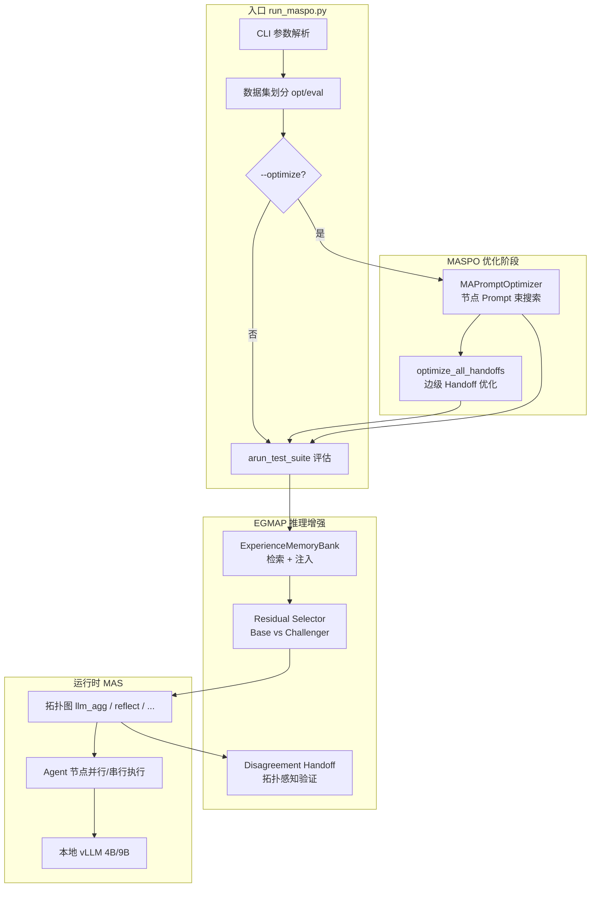
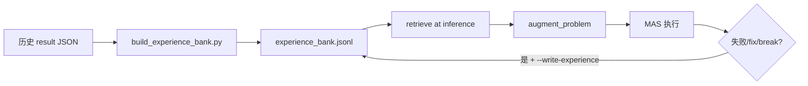
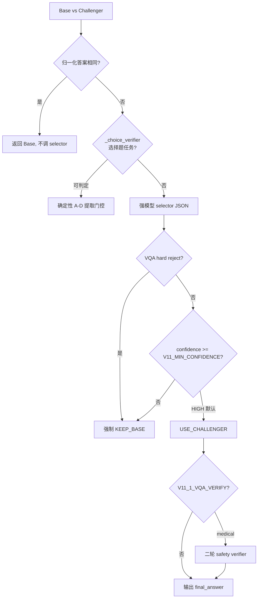
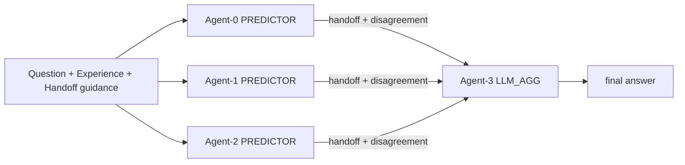

# EGMAP（Experience-Guided Multi-Agent Prompting）完整流水线指南

> **EGMAP** 在本仓库中也称为 **ExHandoff**。它以官方 [MASPO](https://github.com/wangzx1219/MASPO)（ICML 2026）为运行时基座，在其 **联合 Prompt 优化** 与 **多智能体图执行** 之上，叠加一层 **经验引导的协调层**（记忆检索、自适应 Handoff、分歧验证、残差选择器）。

---

## 目录

1. [架构总览](#1-架构总览)
2. [仓库结构与核心模块](#2-仓库结构与核心模块)
3. [端到端流水线](#3-端到端流水线)
4. [MASPO 基座：Prompt 优化](#4-maspo-基座prompt-优化)
5. [EGMAP 扩展层](#5-egmap-扩展层)
6. [多智能体图执行](#6-多智能体图执行)
7. [训练（优化）与推理（评估）](#7-训练优化与推理评估)
8. [数据结构与评分](#8-数据结构与评分)
9. [配置与运行](#9-配置与运行)
10. [关键类与函数索引](#10-关键类与函数索引)

---

## 1. 架构总览

### 1.1 设计原则

| 层次 | 职责 | 实现位置 |
|------|------|----------|
| **MASPO 基座** | 多粒度联合评估、错位驱动搜索、进化束搜索 | `optimizers.py`, `prompts.py` |
| **Handoff-MASPO** | 边级 sender/receiver 契约优化 | `handoff.py`, `optimizers.optimize_all_handoffs` |
| **EGMAP 协调层** | 经验记忆、分歧验证、双路径残差选择 | `experience.py`, `disagreement.py`, `residual_selector.py` |

官方 MASPO 来源见 `OFFICIAL_BASE.md`（commit `e79aa8e`）。EGMAP 不替换 MASPO，而是在同一 `MAS` 运行时上 **注入** 额外上下文与选择逻辑。

### 1.2 系统架构图



### 1.3 `--experience-guided` 一键开关

启用 `--experience-guided` 时，`run_maspo.py` 会自动打开以下子功能：

```496:503:run_maspo.py
    if args.experience_guided:
        # ExHandoff is the full method: MASPO prompts + structured handoff +
        # topology-aware verification + conservative residual selection.
        args.handoff = True
        args.handoff_optimize = True
        args.structured_meta_prompt = True
        args.disagreement_handoff = True
        args.residual_selector = True
```

即：**结构化 meta-prompt 优化 + Handoff 优化 + 分歧 Handoff + 残差选择器 + 经验库检索**。

---

## 2. 仓库结构与核心模块

```
Experience-Guided-Multi-Agent-Prompting/
├── run_maspo.py              # 主入口：优化 + 评估
├── config.py                 # 图类型、任务类型、数据集、vLLM 客户端
├── agent.py                  # Agent、InferenceCache、MAS 图执行
├── agents.py                 # 重导出 agent 模块
├── optimizers.py             # MAPromptOptimizer（MASPO + Handoff-MASPO）
├── experience.py             # 经验记忆库
├── handoff.py                # 边级 Handoff 契约
├── disagreement.py           # 分歧/串行验证上下文
├── residual_selector.py      # 残差选择器（v11）
├── prompts.py                # 默认 Agent 模板与优化模板
├── prompts_structured.py     # 4 阶段结构化 meta-prompt（EGMAP 默认）
├── data_loaders.py           # 数据集加载与 opt/eval 划分
├── utils.py                  # LLM 调用、答案提取、VQA/数学等价判定
├── judges.py                 # LLM Judge / Code Judge
├── scripts/
│   ├── env_unified.sh        # 统一环境变量
│   ├── build_experience_bank.py
│   ├── run_exhandoff_text_na3.sh / nr2.sh
│   └── run_exhandoff_vqa_na3.sh / nr2.sh
├── prompt/                   # 优化后的 prompt/handoff JSON
├── stats/                    # 优化统计
├── memory/experience_bank.jsonl
└── result/                   # 评估结果 JSON
```

---

## 3. 端到端流水线

### 3.1 完整阶段

```mermaid
sequenceDiagram
    participant User
    participant Run as run_maspo.py
    participant Data as data_loaders
    participant Opt as MAPromptOptimizer
    participant Bank as ExperienceMemoryBank
    participant MAS as MAS (Base/Challenger)
    participant Sel as residual_selector

    User->>Run: python run_maspo.py --experience-guided ...
    Run->>Data: load_opt_and_eval (disjoint split)
    
    alt 优化阶段
        Run->>Opt: optimize_all_fixed_rounds (节点 Prompt)
        Opt->>Opt: optimize_all_handoffs (边 Handoff)
        Opt-->>Run: prompt_map, handoff_map → prompt/*.json
    end

    Run->>Bank: 加载 experience_bank.jsonl
    loop 每个 eval 样本
        Run->>Bank: retrieve(problem) → top-k
        Bank-->>Run: augment_problem (注入经验块)
        alt --residual-selector
            par 双路径
                Run->>MAS: Base MAS (无 handoff)
                Run->>MAS: Challenger MAS (handoff + disagreement)
            end
            Run->>Sel: select_residual_answer
            Sel-->>Run: final_answer
        else 单路径
            Run->>MAS: arun(problem)
        end
        Run->>Run: score_answer + build_memory_entry
    end
    Run->>Run: 写入 result/*.json
    opt --write-experience
        Run->>Bank: append_many(new entries)
    end
```

### 3.2 阶段说明

| 阶段 | 输入 | 输出 | 关键函数 |
|------|------|------|----------|
| **1. 配置与划分** | CLI 参数、数据集 | opt 池 + eval 集 | `load_opt_and_eval`, `main()` |
| **2. Prompt 优化** | opt 问题列表、seed prompt | `prompt_map` | `optimize_all_fixed_rounds` |
| **3. Handoff 优化** | 优化后 prompt、边 trace | `handoff_map` | `optimize_all_handoffs` |
| **4. 经验检索** | 当前问题、JSONL 记忆库 | 增强后 problem | `ExperienceMemoryBank.retrieve`, `augment_problem` |
| **5. 图执行** | problem、prompt/handoff | final + raw_trace | `MAS.arun_with_cache` |
| **6. 残差选择** | Base/Challenger 双答案 | 最终答案 | `select_residual_answer` |
| **7. 评分与写回** | 模型输出 vs 标答 | correct、统计 | `score_answer`, `arun_test_suite` |

---

## 4. MASPO 基座：Prompt 优化

### 4.1 核心类 `MAPromptOptimizer`

定义于 `optimizers.py`，构造函数接收：

- `mas: MAS` — 图拓扑与任务类型
- `train_questions: List[str]` — 优化用问题（无标签，仅问题文本）
- `seed_prompt_map` — 各 Agent 初始 prompt
- `evaluator_client` — 强模型（默认 Qwen3.5-9B）用于 pairwise 比较
- `seed_handoff_map`, `use_handoff`, `use_structured_meta_prompt`, `use_disagreement_handoff`
- `image_lookup` — VQA 优化时的 question→base64 图像映射

### 4.2 三种优化模式

| 模式 | CLI 标志 | 方法 |
|------|----------|------|
| 拓扑序单次 | 默认 `--optimize` | `optimize_all` |
| 轮询 | `--round-robin` | `optimize_all_round_robin` |
| **固定轮次（推荐）** | `--fixed-rounds` | `optimize_all_fixed_rounds` |

EGMAP 实验脚本均使用 **fixed-rounds + beam-refresh + lookahead-score + misleading-sampling**。

### 4.3 固定轮次优化流程

`optimize_all_fixed_rounds` 按拓扑序遍历可优化 Agent，每个 Agent 执行若干轮束搜索：

```929:996:optimizers.py
    async def optimize_all_fixed_rounds(self,
                                    requirement: str = " ",
                                    max_total_depth: int = 10,
                                    rounds_per_turn: int = 2,
                                    beam_width: int = 2,
                                    ...
                                    use_beam_refresh: bool = False,
                                    use_feedback: bool = False,
                                    use_misleading_sampling: bool = False,
                                    use_lookahead_score: bool = False,
                                    lookahead_weights: Tuple[float, float, float] = (0.4, 0.4, 0.2)) -> Dict[int, str]:
        ...
        while True:
            ...
            for aid in optimizable_agents:
                ...
                await self._optimize_agent_fixed_rounds(...)
```

**深度/轮次** 由环境变量控制（脚本中设置）：
- `MASPO_FIXED_DEPTH`（默认 3）
- `MASPO_FIXED_ROUNDS_PER_TURN`（默认 3）

### 4.4 多粒度联合评估 `_evaluate_candidate`

对每个候选 prompt，从该 Agent 节点 **重跑下游**（`arun_from_node`），用强模型做 pairwise 比较：

| 比较类型 | 含义 | 权重（lookahead 模式） |
|----------|------|------------------------|
| **Local** | 当前 Agent 输出 vs 基线 | 0.4 |
| **Next Local** | 直接后继 Agent 输出 | 0.4 |
| **Global** | 终端最终答案 | 0.2 |

默认 `--lookahead-weights 4:4:2`，在 `run_maspo.py` 中归一化。

**Misleading Sampling**：挖掘「Local Win / Global Lose」错位样本，注入采样池作为 hard negative（`use_misleading_sampling`）。

**Beam Refresh**：当上游 peer prompt 更新后，重新评估束内节点分数，缓解非平稳性（`use_beam_refresh`）。

### 4.5 Prompt 提案 `_propose_new_prompt`

- 官方模板：`PROMPT_OPTIMIZE_TEMPLATE`（`prompts.py`）
- **EGMAP 默认**：`PROMPT_OPTIMIZE_TEMPLATE_STRUCTURED`（`prompts_structured.py`）— 四阶段诊断：证据分组 → 错误分类 → 根因定位 → 最小化编辑

VQA 任务启用 **image gradient**：优化器 LLM 可见样本图像，用于视觉 grounding 诊断。

### 4.6 Handoff-MASPO：`optimize_all_handoffs`

在节点 prompt 优化完成后，对每条边 `src->dst` 独立优化 Handoff 契约：

1. 在训练样本上跑完整 MAS，收集边 trace（sender 输出、receiver 上下文、最终输出）
2. 强模型根据 `HANDOFF_OPTIMIZE_TEMPLATE` 生成新 handoff
3. `_evaluate_handoff_candidate`：从 sender 节点重跑，比较 global/receiver 胜率
4. 得分 `0.7 * global_rate + 0.3 * receiver_rate`，优于基线则更新

详见 `optimizers.py` 第 1373–1450 行。

---

## 5. EGMAP 扩展层

### 5.1 经验记忆库（Experience Memory Bank）

**文件**：`experience.py`  
**存储格式**：JSONL，每行一条 `Experience` 记录。

#### 数据结构

```python
@dataclass
class Experience:
    dataset: str
    task_type: str
    problem: str          # 历史问题文本（检索用）
    error_type: str         # 无标签错误签名
    advice: str             # 可注入的修正规则（非 gold answer）
    source: str
    correct: Optional[bool]
    model_answer: str
    metadata: Dict
```

#### 检索算法 `retrieve`

基于 **Jaccard 词重叠**（去停用词后的 token 集合），叠加任务/数据集偏置：

```160:180:experience.py
    def retrieve(self, problem: str, task_type: TaskType, dataset: str = "", top_k: Optional[int] = None) -> List[Tuple[Experience, float]]:
        ...
            overlap = len(query_tokens & mem_tokens)
            union = max(1, len(query_tokens | mem_tokens))
            score = overlap / union
            if dataset and mem.dataset == dataset:
                score += 0.25
            if mem.task_type == task_value:
                score += 0.15
            if mem.correct is False:
                score += 0.05
```

**设计约束**：检索结果只暴露 `error_type` + `advice`（修正规则），**不泄露标准答案**。

#### 注入 `augment_problem`

将格式化记忆块追加到问题末尾：

```192:219:experience.py
def format_experience_context(matches: Iterable[Tuple[Experience, float]], task_type: TaskType) -> str:
    ...
    lines = [
        "[EXPERIENCE-GUIDED HANDOFF MEMORY]",
        "Use these retrieved failure patterns as reusable guidance. They are not gold answers for the current problem.",
    ]
    ...
    lines.append("[/EXPERIENCE-GUIDED HANDOFF MEMORY]")
```

在 `aprocess_single` 中，检索发生在 MAS 执行 **之前**：

```67:74:run_maspo.py
    if experience_bank:
        retrieved = experience_bank.retrieve(
            problem,
            task_type,
            dataset=str(item.get("dataset", "")),
            top_k=experience_top_k,
        )
        problem, experience_matches = augment_problem(problem, retrieved, task_type)
```

#### 写入 `build_memory_entry`

评估结束后，对 **失败 / fix_gain / break_loss** 事件生成新记忆：

```241:266:experience.py
def build_memory_entry(...):
    interesting = (not correct) or residual.get("fix_gain") or residual.get("break_loss")
    if not interesting:
        return None
    error_type = classify_error(task_type, problem, output or "", raw or "")
    ...
```

`classify_error` 按任务类型推断无标签错误签名（如 `calculation_or_algebra_error`、`visual_chart_or_numeric_grounding`）；`advice_for_error` 映射为可 prompt 的修正规则。

#### 离线构建

```bash
python scripts/build_experience_bank.py "result/*.json" \
  --output memory/experience_bank.jsonl --overwrite
```

从已有 `result/*.json` 的 `detailed` 字段抽取条目（`scripts/build_experience_bank.py`）。



---

### 5.2 自适应 Handoff（Adaptive Handoff）

**文件**：`handoff.py`

Handoff 是 **边级** 契约（非节点 prompt），键为 `"src->dst"`。

#### 默认契约 `default_handoff_for_edge`

按任务类型区分 sender/receiver 规则：

| 任务类型 | Receiver 策略 |
|----------|---------------|
| MATH / MATH_CHOICE | 高置信度时 **保留** 上游答案，仅在明确计算/逻辑错误时修正 |
| REASONING_CHOICE | **独立重推**，仅当自推结果一致才保留 |
| CODE | **逐例 trace** docstring 示例，任一失败则修正 |
| VQA | 视觉证据一致则保留，需明确视觉矛盾才翻转 |

必需字段由 `_task_fields` 定义（如 `key_result`, `visual_evidence`, `confidence`）。

#### 运行时注入

- **Sender**：`_question_with_sender_handoff` 在问题后追加 `[Inter-Agent Handoff Requirements]`
- **Receiver**：`_context_for_node` 将上游输出包装为 `[HANDOFF Agent-i -> Agent-j]` 块

```413:427:agent.py
        blocks = []
        for pred_id in predecessors:
            if pred_id in outputs:
                blocks.append(
                    format_receiver_context(pred_id, agent_id, outputs.get(pred_id, ""), self.handoff_map)
                )
        base_context = "\n---\n".join(blocks)
        if self.use_disagreement_handoff:
            ...
```

---

### 5.3 分歧验证（Disagreement Verification）

**文件**：`disagreement.py`  
**开关**：`--disagreement-handoff`（EGMAP 默认开启）

拓扑感知两种模式：

| 场景 | 函数 | 行为 |
|------|------|------|
| 多前驱（如 llm_agg 的 K 个 predictor → aggregator） | `format_disagreement_context` | 仅当上游 **提取答案不一致** 时注入 `[ADAPTIVE DISAGREEMENT HANDOFF]` |
| 单前驱（如 reflect 链） | `format_sequential_verification_context` | 注入 `[ADAPTIVE SEQUENTIAL VERIFICATION]`，trust-but-verify |

分歧报告包含：候选答案分组、各 Agent 证据片段、任务相关 receiver 规则。

环境变量：
- `V10_ALWAYS_DISAGREE_REPORT=1` — 强制输出报告（即使一致）
- `V10_SEQUENTIAL_VERIFY=0` — 关闭串行验证块

---

### 5.4 残差选择器（Residual Selector）

**文件**：`residual_selector.py`  
**开关**：`--residual-selector`（EGMAP 默认开启）

#### 双路径执行

在 `aprocess_single` 中并行运行两条 MAS 路径：

| 路径 | Handoff | Disagreement | 角色 |
|------|---------|--------------|------|
| **Base** | 否 | 否 | MASPO 风格基线 |
| **Challenger** | 是 | 是 | ExHandoff 增强路径 |

```104:124:run_maspo.py
            base_result, challenger_result = await asyncio.gather(
                base_mas.arun(problem, image=image),
                challenger_mas.arun(problem, image=image),
            )
            ...
            selection = await select_residual_answer(
                selector_client or create_evaluator_client(),
                problem=problem,
                task_type=task_type,
                base_answer=base_output,
                ...
            )
```

两条路径共享同一 **经验增强后的 problem** 和 **优化后的 prompt_map**。

#### 选择逻辑 `select_residual_answer`



**核心原则**：默认 **KEEP_BASE**；仅当 Challenger 提供 **具体、可命名错误** 且置信度 ≥ `V11_MIN_CONFIDENCE`（默认 `HIGH`）时才切换。

**确定性选择题验证器** `_choice_verifier`：当 Base 无法提取 A-D 选项而 Challenger 可以（或反之），无需调用 LLM，直接选择可提取的一方（**不使用 gold label**）。

**VQA 专用**：
- `V11_1_VQA_MODE` / `V11_VQA_MODE`：数据集模式（`vqarad`, `slake`, `chartqa`, `textvqa`）
- `_vqa_hard_reject`：答案形态安全检查（如 ChartQA 实体/数值类型不匹配）
- `V11_1_VQA_VERIFY=1`：医学 VQA 二轮 safety verifier

统计字段写入 `result` JSON 的 `residual_stats`：`fix_gain`（Base 错→最终对）、`break_loss`（Base 对→最终错）等。

---

## 6. 多智能体图执行

### 6.1 支持的拓扑 `GraphType`

定义于 `config.py`：

| 拓扑 | 结构 | 典型用途 |
|------|------|----------|
| `llm_agg` | K 个 PREDICTOR → 1 个 LLM_AGG | EGMAP 文本/VQA 主实验（`--na 3`） |
| `reflect` | PREDICTOR ↔ REFLECTOR 链（`--nr` 轮） | 串行反思（`--nr 2`） |
| `aggregate` | K 个 PREDICTOR → AGGREGATOR（投票） | 基线对比 |
| `debate` / `debate_llm_agg` | 辩论 + 聚合 | 扩展实验 |
| `summarize` | SUMMARIZER → PREDICTOR | 带上下文任务 |
| `hierarchical` | 多专家 → TASK_SUMMARIZER | GPQA 等 |

`MAS._build()` 在 `agent.py` 中根据 `GraphType` 实例化 Agent 列表与 `edges` 邻接表。

### 6.2 层级并行执行 `arun_with_cache`

```429:472:agent.py
    async def arun_with_cache(self, question: str, ...):
        cache = InferenceCache()
        levels = self._get_levels()   # 按拓扑分层
        for level in levels:
            tasks = []
            for agent_id in level:
                ...
                q_with_handoff = self._question_with_sender_handoff(question, agent_id)
                tasks.append(self._run_single_agent(...))
            results = await asyncio.gather(*tasks)  # 同层并行
            for agent_id, (raw, short) in zip(level, results):
                cache.set_node_data(agent_id, ctx, raw, short)
        final_answer = extract_output(final_raw, self.task_type)
```

**InferenceCache** 保存每节点的 `node_inputs`、`node_outputs_raw`、`node_outputs_short`（压缩版），供优化阶段 `arun_from_node` 做 **部分重跑**。

### 6.3 Agent 执行细节

- `Agent.arun_full`：调用 work 模型（4B），PREDICTOR 可选 self-consistency（`SELF_CONSISTENCY_N`）
- 终端节点：short 输出 = `extract_output(raw, task_type)`
- VQA：通过 `async_call_llm(..., images=[base64])` 发送 OpenAI 兼容 vision 消息（`utils.py`）
- AGGREGATOR：多数投票 / code_vote，不调用 LLM

### 6.4 llm_agg 拓扑示例（na=3）



---

## 7. 训练（优化）与推理（评估）

### 7.1 概念区分

本仓库 **无梯度训练**；「训练」指 **无标签 Prompt/Handoff 联合优化**，「推理」指 **在 held-out 集上运行 MAS 并评分**。

| | 优化（Training-like） | 评估（Inference） |
|--|----------------------|-------------------|
| **数据** | opt 池（默认 100 题，seed 固定） | eval 集（disjoint，排除 opt） |
| **模型** | 强模型 9B 做 pairwise 比较 | 弱模型 4B 执行 Agent |
| **输出** | `prompt/*.json`, `handoff/*.json` | `result/*.json` |
| **经验库** | 不使用检索 | retrieve + 可选 write |

### 7.2 Disjoint 划分

默认 `--disjoint-eval`（可 `--no-disjoint-eval` 关闭）：

```97:110:data_loaders.py
def load_opt_and_eval(dataset: str, opt_size: int = 50, seed: int = 42):
    data = load_test_data(dataset)
    opt_items = random.sample(data, opt_size)
    opt_ids = {item['unique_id'] for item in opt_items}
    eval_data = [item for item in data if item['unique_id'] not in opt_ids]
```

### 7.3 仅推理（跳过优化）

```bash
python run_maspo.py \
  --dataset math500 --graph llm_agg --na 3 \
  --prompt-file prompt/handoff_maspo_math500_llm_agg_handoff_ms_ls_prompts.json \
  --handoff-file prompt/handoff_maspo_math500_llm_agg_handoff_ms_ls_handoffs.json \
  --experience-guided \
  --sample-size 200 --seed 123
```

若 `--optimize` 与 `--prompt-file` 同时存在，优化阶段会被跳过，直接加载已有 prompt。

---

## 8. 数据结构与评分

### 8.1 样本条目（data_loaders）

每条 eval 样本包含：

```python
{
    "problem": str,
    "unique_id": str,
    "task_type": TaskType,
    "dataset": str,
    "answer": str,           # CODE 任务为空，用 test_list
    "image": str,            # VQA: base64
    "test_list": [...],      # CODE
}
```

数据集配置见 `config.DATASET_CONFIG`；根路径 `HANDOFF_DATASET_ROOT`（默认 `/public2/TangXiaoying/agentv5/datasets`，VQA benchmark 脚本指向 `/mnt/afs/L202500372/data/handoff_datasets`）。

### 8.2 任务类型与评分 `score_answer`

| TaskType | 默认评分 |
|----------|----------|
| MATH | 字符串归一化 + `math_equivalent` |
| MATH_CHOICE / REASONING_CHOICE | 归一化 + 选项包含 |
| CODE | `CodeJudgeAgent` 执行 test_list |
| VQA_OPEN | `vqa_open_equivalent`（确定性）；或 `VQA_LLM_JUDGE=1` / `--use-llm-judge` |
| VQA_CHOICE | 同 MATH_CHOICE 或 LLM Judge |

### 8.3 结果 JSON 结构

`result/{dataset}_{graph}_{suffix}.json`：

```json
{
  "total": 200,
  "task_type": "math",
  "graph_types": { "llm_agg": { "correct": 150, "accuracy": 0.75, ... } },
  "split_info": { "disjoint_eval": true, "opt_count": 100, "eval_count": 400 },
  "residual_stats": { "fix_gain": 12, "break_loss": 3, ... },
  "experience_stats": { "retrieval_enabled": true, "new_entries": 45 },
  "detailed": [
    {
      "unique_id": "...",
      "problem": "...",
      "models": {
        "llm_agg": {
          "output": "...",
          "correct": true,
          "residual": { "base_correct": true, "challenger_correct": true, "selection": {...} },
          "experience": [{ "error_type": "...", "score": 0.42 }]
        }
      }
    }
  ]
}
```

**输出文件 suffix 规则**（`run_maspo.py` 742–756 行）：`full_maspo` + `_handoff` + `_dh` + `_v11` + `_egmap` 等组合。

---

## 9. 配置与运行

### 9.1 环境准备

```bash
# 1. 统一环境
source scripts/env_unified.sh

# 2. 启动 vLLM（work 8005 / strong 8004）
# 见父目录 scripts/serve_vllm_egmap.sh

# 3. 安装依赖
pip install -r requirements.txt
```

`env_unified.sh` 关键变量：

| 变量 | 默认 | 含义 |
|------|------|------|
| `MASPO_WORK_PORT` | 8005 | 弱模型 vLLM 端口 |
| `MASPO_STRONG_PORT` | 8004 | 强模型端口 |
| `MASPO_MODEL` | Qwen/Qwen3.5-4B | Agent 执行模型 |
| `MASPO_EVALUATOR_MODEL` | Qwen/Qwen3.5-9B | 优化/选择器/ Judge |
| `HANDOFF_DATASET_ROOT` | 见 config | 数据集根目录 |
| `MASPO_WORK_MAX_TOKENS` | 4096 | 弱模型输出上限 |
| `MASPO_STRONG_MAX_TOKENS` | 16384 | 强模型输出上限 |

### 9.2 EGMAP 完整命令（推荐）

```bash
source scripts/env_unified.sh
python run_maspo.py \
  --dataset math500 \
  --graph llm_agg --na 3 \
  --optimize --fixed-rounds --beam-refresh --lookahead-score --misleading-sampling \
  --experience-guided \
  --seed 123 --sample-size 200 --opt-size 100 --max-concurrent 4
```

### 9.3 批量脚本

| 脚本 | 拓扑 | 数据集 |
|------|------|--------|
| `scripts/run_exhandoff_text_na3.sh` | llm_agg, na=3 | math500, agieval, aqua, gpqa, humaneval |
| `scripts/run_exhandoff_text_nr2.sh` | reflect, nr=2 | 同上 |
| `scripts/run_exhandoff_vqa_na3.sh` | llm_agg, na=3 | vqarad, slake, chartqa, textvqa |
| `scripts/run_exhandoff_vqa_nr2.sh` | reflect, nr=2 | 同上 |

父工作区 VQA 一键 benchmark：`/mnt/afs/L202500372/scripts/run_vqa_egmap_benchmark.sh`（数据准备 + vLLM + 批量 na3/nr2）。

### 9.4 主要 CLI 参数速查

| 参数 | EGMAP 相关说明 |
|------|----------------|
| `--experience-guided` | 开启完整 EGMAP |
| `--experience-bank` | 记忆库路径（默认 `memory/experience_bank.jsonl`） |
| `--experience-top-k` | 检索条数（默认 3） |
| `--write-experience` | 评估后追加新记忆 |
| `--handoff` / `--handoff-optimize` | Handoff 执行/优化 |
| `--disagreement-handoff` | 分歧/串行验证 |
| `--residual-selector` | 双路径残差选择 |
| `--v11-min-confidence` | 覆盖门控：LOW/MEDIUM/HIGH |
| `--structured-meta-prompt` | 4 阶段 meta-prompt（EGMAP 自动开启） |
| `--na` / `--nr` | 并行 predictor 数 / reflect 轮数 |
| `--opt-size` / `--disjoint-eval` | 优化池大小 / held-out 评估 |

### 9.5 调试环境变量

| 变量 | 作用 |
|------|------|
| `V11_MIN_CONFIDENCE` | 残差选择最低置信度 |
| `V11_1_VQA_MODE` | VQA 数据集模式 |
| `V11_CHOICE_VERIFIER` | 选择题确定性验证（默认开） |
| `V11_1_VQA_VERIFY` | 医学 VQA 二轮 safety |
| `EGMAP_SHOW_MEMORY_EXAMPLES` | 注入时显示 prior_problem |
| `SELF_CONSISTENCY_N` | PREDICTOR 自洽采样数 |
| `MASPO_FIXED_DEPTH` / `MASPO_FIXED_ROUNDS_PER_TURN` | 优化深度/轮次 |

---

## 10. 关键类与函数索引

### 10.1 入口与编排

| 符号 | 文件 | 说明 |
|------|------|------|
| `main()` | `run_maspo.py` | CLI 入口，串联优化与评估 |
| `aprocess_single()` | `run_maspo.py` | 单样本：检索→MAS/残差→评分 |
| `arun_test_suite()` | `run_maspo.py` | 并发评估、聚合统计、写 JSON |
| `score_answer()` | `run_maspo.py` | 任务相关正确性判定 |

### 10.2 MAS 运行时

| 符号 | 文件 | 说明 |
|------|------|------|
| `MAS` | `agent.py` | 多智能体系统：建图、注入 prompt/handoff、执行 |
| `Agent` | `agent.py` | 单 Agent：模板格式化、LLM 调用、压缩 |
| `InferenceCache` | `agent.py` | 节点 I/O 缓存，支持 `arun_from_node` |
| `async_call_llm()` | `utils.py` | 统一 LLM 调用（文本/vision、token 截断） |
| `extract_output()` | `utils.py` | 按任务类型提取最终答案 |

### 10.3 MASPO 优化

| 符号 | 文件 | 说明 |
|------|------|------|
| `MAPromptOptimizer` | `optimizers.py` | 联合 Prompt + Handoff 优化器 |
| `AgentOptState` | `optimizers.py` | 单 Agent 束搜索状态 |
| `_evaluate_candidate()` | `optimizers.py` | 多粒度 win-rate 评估 |
| `optimize_all_fixed_rounds()` | `optimizers.py` | 固定轮次拓扑优化 |
| `optimize_all_handoffs()` | `optimizers.py` | 边级 Handoff 优化 |

### 10.4 EGMAP 模块

| 符号 | 文件 | 说明 |
|------|------|------|
| `ExperienceMemoryBank` | `experience.py` | JSONL 记忆库 load/retrieve/append |
| `augment_problem()` | `experience.py` | 经验块注入 |
| `build_memory_entry()` | `experience.py` | 评估后写记忆 |
| `classify_error()` | `experience.py` | 无标签错误签名 |
| `default_handoff_for_edge()` | `handoff.py` | 任务相关默认 Handoff |
| `format_disagreement_context()` | `disagreement.py` | 并行拓扑分歧报告 |
| `format_sequential_verification_context()` | `disagreement.py` | 串行 trust-but-verify |
| `select_residual_answer()` | `residual_selector.py` | Base/Challenger 门控选择 |
| `_choice_verifier()` | `residual_selector.py` | 选择题确定性门控 |

### 10.5 数据与配置

| 符号 | 文件 | 说明 |
|------|------|------|
| `DATASET_CONFIG` | `config.py` | 数据集路径与 task_type |
| `GraphType` / `TaskType` / `AgentType` | `config.py` | 枚举定义 |
| `load_test_data()` | `data_loaders.py` | 加载并规范化样本 |
| `load_opt_and_eval()` | `data_loaders.py` |_disjoint 划分 |
| `get_agent_template()` | `prompts.py` | 默认 Agent prompt 模板 |

---

## 附录：EGMAP vs 纯 MASPO 对比

| 能力 | 纯 MASPO | EGMAP (`--experience-guided`) |
|------|----------|-------------------------------|
| 节点 Prompt 优化 | ✓ | ✓（+ 结构化 meta-prompt） |
| 边 Handoff 优化 | 可选 | ✓（自动开启） |
| 经验记忆检索 | ✗ | ✓ |
| 分歧/串行验证 | ✗ | ✓ |
| 残差双路径选择 | ✗ | ✓ |
| 运行时 LLM 调用 | 1× MAS | 2× MAS + 0~1× selector（同答跳过） |

---

*文档基于仓库源码综合编写，最后更新与代码版本同步。官方 MASPO 论文：[arXiv:2605.06623](https://arxiv.org/abs/2605.06623)。*
