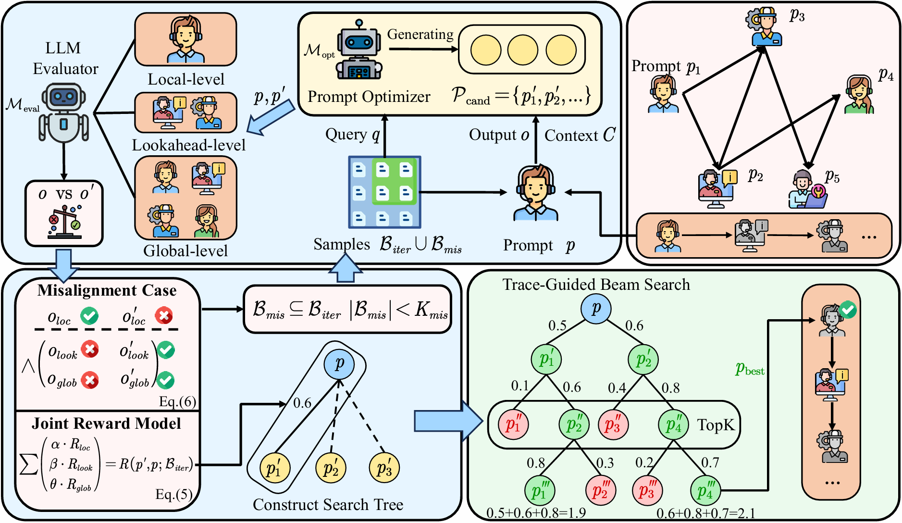

# MASPO
This repository anonymously releases the codes and data for the paper MASPO: Joint Prompt Co-evolution for LLM-based Multi-Agent Systems

## **📣 News**
- **[08/05/2026]** Our paper has been submitted to arXiv: [https://arxiv.org/abs/2605.06623](https://arxiv.org/abs/2605.06623)!
- **[01/05/2026]** 🎉🎉Our paper is accepted by [ICML 2026]!🎉🎉

## **🧠 About MASPO**
MASPO is a novel joint prompt optimization framework designed for LLM-based Multi-Agent Systems (MAS), motivated by the observation that the quality of role-specific prompts critically governs agent behaviors and interaction dynamics, yet optimizing them jointly is challenging due to the misalignment between local agent objectives and holistic system goals. MASPO automatically and iteratively refines prompts across the entire system without relying on ground-truth labels, bridging the gap between local interactions and global outcomes. It consists of three key components:

- **Multi-Granularity Joint Evaluation**: Assess each candidate prompt along three complementary dimensions—*Local Validity* (role-specific adherence), *Lookahead Potential* (utility for immediate successor agents), and *Global Alignment* (impact on the final system response)—to resolve the credit assignment dilemma in MAS.
- **Misalignment-Driven Generative Search**: Explicitly mine *Misalignment Cases*, where an agent fulfills its local role but induces downstream or system-wide failure, and inject them as hard negatives to guide the optimizer in repairing specific interaction breakdowns.
- **Evolutionary Beam Search with Adaptive Dynamics**: Navigate the high-dimensional prompt space via a trace-guided beam search, orchestrated by a coordinate ascent-style scheduling protocol and a *Beam Refresh* mechanism that re-anchors stale candidate scores to mitigate the non-stationarity caused by co-evolving peer agents.

<p align="center">
  
</p>
<p align="center">The Framework of MASPO</p>


## **📖 Parameter Reference for `run_maspo.py`**
This script serves as the main entry point for running Multi-Agent System (MAS) evaluation and prompt optimization across various datasets and task types.
### **Basic Arguments**
| Argument | Type |  Default | Description |
|----------|------|---------|-------------|
| `--dataset` | `str` |  - | Dataset to use.|
| `--graph` | `str` | `reflect` | Graph topology type.|
| `--sample-size` | `int` | `None` | Number of samples to use for evaluation. If not set, uses all available samples |
| `--max-concurrent` | `int` |  `20` | Maximum number of concurrent tasks during evaluation |
| `--nr` | `int` |`1` | Number of reflection rounds (applicable for `reflect` topology) |
### **Optimization Arguments**
| Argument | Type | Default | Description |
|----------|------|---------|-------------|
| `--optimize` | `flag` | `False` | Enable prompt optimization. If not set, uses original/default prompts |
| `--prompt-file` | `str` | `None` | Path to a pre-optimized prompt file (JSON format). Skips optimization if provided |

### **Optimization Mode Selection**
| Argument | Type | Default | Description |
|----------|------|---------|-------------|
| `--round-robin` | `flag` | `False` | Use round-robin optimization instead of sequential topological optimization |
| `--fixed-rounds` | `flag` | `False` | Use fixed rounds per turn optimization (processes each agent for a fixed number of rounds before switching) |

### **Advanced Optimization Strategies**
| Argument | Type | Default | Description |
|----------|------|---------|-------------|
| `--beam-refresh` | `flag` | `False` | Enable Beam Refresh strategy to re-score beam nodes based on updated partner prompts when revisiting an agent |
| `--feedback` | `flag` | `False` | Enable multi-agent collaborative feedback. Passes bad cases from downstream agents to upstream agents during optimization |
| `--misleading-sampling` | `flag` | `False` | Enable injection of upstream "misleading cases" (cases where Local Win but Global Lose) into the sampling pool |
| `--lookahead-score` | `flag` | `False` | Enable Lookahead Scoring that considers downstream agent performance |

## **🚀 Quick Start**<a name="start"></a>

### **Installation**

```bash
pip install -r requirments.txt
```


### **Usage Examples**
```bash
# Basic evaluation without optimization
python run_tbdspo.py --dataset math --graph reflect
# Evaluation with prompt optimization (topological order)
python run_tbdspo.py --dataset aqua --graph reflect --optimize

# Fixed-rounds optimization with all advanced strategies enabled
python run_tbdspo.py --dataset mbpp --graph reflect --optimize --fixed-rounds  --beam-refresh
# Using pre-optimized prompts
python run_tbdspo.py --dataset humaneval --graph reflect --prompt-file prompt/optimized_humaneval.json
# MASPO
python run_tbdspo.py --dataset aqua --graph reflect --optimize --fixed-rounds --beam-refresh --lookahead-score --misleading-sampling
```

## **📜 Citation**
If you find this work useful, please cite:
```bash
@misc{wang2026maspojointpromptoptimization,
      title={MASPO: Joint Prompt Optimization for LLM-based Multi-Agent Systems}, 
      author={Zhexuan Wang and Xuebo Liu and Li Wang and Zifei Shan and Yutong Wang and Zhenxi Song and Min Zhang},
      year={2026},
      eprint={2605.06623},
      archivePrefix={arXiv},
      primaryClass={cs.AI},
      url={https://arxiv.org/abs/2605.06623}, 
}
```